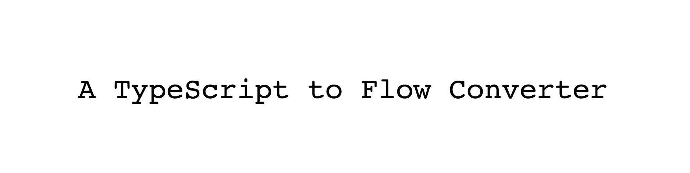

<p align="center">
  


  <br/>
  

  <br/>
  <!-- badges -->
  
  <a href="https://travis-ci.org/dawsbot/typewriter">
    
  </a>
  <a href="https://www.npmjs.com/package/tw-cli">
    
  </a>
</p>

<br/>

🎉 Using TypeScript is fun, but Flow is even better. The typing systems are similar, but the community is quickly supporting Flow more and more. With this increase in activity, many companies are doubling down on Flow (Facebook and Uber to name a few).

Adopt Flow instantly with **TypeWriter**.

⚡️ Tell **TypeWriter** which files you would like converted and it will automatically perform a [big list of codemods](#default-codemods) instantly!

<br/>

🔧 *There is minor manual work after running TypeWriter. If you see any room for improvement, please create an issue or contribute!*

<br/>

## Install

```
$ npm install --global tw-cli
```

## Usage

```
$ typewriter src
✔ Converted src/index.ts -> src/index.js
✔ Converted src/App.tsx -> src/App.jsx
```

[See more examples](#more-help)

## Default Codemods

- [x] Rename files from `.ts` -> `.js` & `.tsx` -> `.jsx`
```
  a.ts -> a.js
  a.tsx -> a.jsx
```

<br/>

- [x] Add flow keyword quote (`// @flow`)
```
  "content" -> "// @flow\ncontent"
```

<br/>

- [x] Strip `public` and `private` keywords
```
  "public render()" -> "render()"
```

<br/>

- [x] Interface -> type
```
  "interface Prop {}" -> "type Prop = {}"
```

<br/>

- [x] Type imports

* *ensure your types are in `types` or `types/*`*

```
// imports from types change
// "import {Prop} from './types'" -> "import type {Prop} from './types'"

// imports from everywhere else are left alone
// "import {NotProp} from './not-types'" -> "import {NotProp} from './not-types'"
```

## More Help

```
$ typewriter --help

  TypeScript -> Flow Converter

  Usage
     $ typewriter <path|glob> [...]

  Examples
     $ typewriter index.ts
     ✔ Converted index.ts -> index.js

     $ typewriter src
     ✔ Converted src/index.ts -> src/index.js
     ✔ Converted src/App.tsx -> src/App.jsx

     # ignore node_modules

     $ typewriter * '!node_modules/*'
     ✔ Converted src/index.ts -> src/index.js
     ✔ Converted src/App.tsx -> src/App.jsx
     ✔ Converted index.ts -> index.js
```

## Support Development

The work done for this project is free. If you save time with TypeWriter, consider making a [donation](https://liberapay.com/DawsBot).

Are Bitcoin (BTC) donations more your style?

14xAeqDucUpRZkSDQrHCXaKsWmNPeqaB5q


## License

MIT © [Dawson Botsford](https://dawsbot.com)
